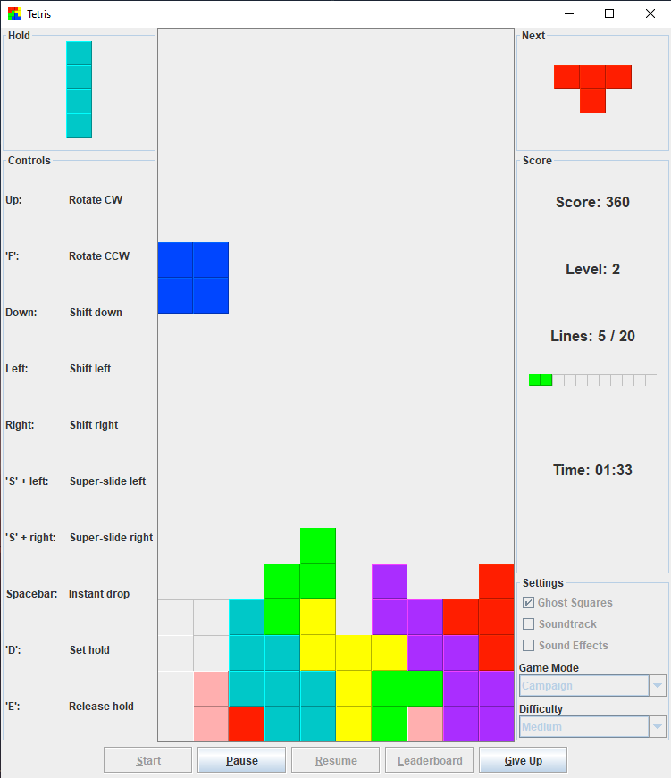

The Tetris we all know and love built in Java using Swing!

# Features
- Campaign mode which provides 10 levels of play, each sporting a classic retro video game soundtrack
- Time-attack mode which restricts the amount of time allowed for each level
- Free play mode which allows the player to continue play until they game over
- Local leaderboard to track your scores overtime

# Building / Running
Run `gradlew jar` from the root of this project to build an executable JAR file at **build/libs/Tetris.jar**
